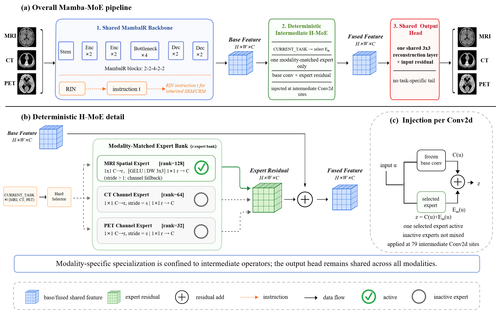

# Mamba-MoE

Official implementation of **Mamba-MoE: Deterministic Intermediate Expert Isolation With a Shared Reconstruction Head for All-in-One Medical Image Restoration**.

<p align="center">
  
</p>

<p align="center">
  <em>Deterministic intermediate expert isolation with a shared reconstruction head for all-in-one medical image restoration.</em>
</p>

Mamba-MoE is an all-in-one medical image restoration framework for MRI super-resolution, CT denoising, and PET restoration. It builds on an AMIR-style instruction-guided Mamba encoder-decoder and injects deterministic modality-matched residual experts into intermediate convolutional operators. MRI uses a spatial expert for stride-1 wrapped convolutions, whereas CT and PET use compact channel experts. The final reconstruction layer is shared across modalities.

> **Release status.** This repository provides the core shared-head Mamba-MoE model, the main 120,000-step training entry point, strict checkpoint evaluation code, paired-file dataloaders, and prediction export utilities. Large medical datasets, pretrained checkpoints, saved predictions, and case-level statistical artifacts are not stored in Git and will be distributed separately when the manuscript artifact package is finalized.

## Key Features

- **All-in-one restoration:** one model handles MRI, CT, and PET restoration tasks.
- **Deterministic expert isolation:** the known modality identity activates one matched expert branch without learned soft expert mixing.
- **Heterogeneous experts:** MRI uses spatial residual experts, while CT and PET use channel-oriented residual experts.
- **Intermediate injection:** H-MoE wraps selected intermediate `Conv2d` operators and computes `z = C(u) + E_m(u)`.
- **Shared reconstruction head:** one shared `3x3` reconstruction layer is used for all modalities with a global input residual.
- **Paired-file dataloader:** a lightweight loader supports local paired `input`/`gt` restoration files for MRI, CT, and PET.

## Repository Structure

```text
Mamba-MoE/
  README.md
  LICENSE
  requirements.txt
  environment.yml
  assets/
    fig1.png
    fig2.png
  docs/
    metrics.md
    release_manifest.md
    reproducibility.md
  configs/
    mamba_moe_sharedhead.yaml
  dataset/
    README.md
  mamba_moe/
    __init__.py
    data.py
    model.py
    vmamba.py
  paper_code/
    README.md
    train_main_120k.py
    evaluate_strict.py
    model/
      FreqMamba_MoE_SharedHead.py
  scripts/
    evaluate.py
    export_predictions.py
    run_minimal_inference.py
    train.py
```

## Installation

```bash
conda create -n mamba_moe python=3.10
conda activate mamba_moe
pip install -r requirements.txt
```

The model uses the project-compatible VSSBlock implementation provided in `mamba_moe/vmamba.py`. The import path in `mamba_moe/model.py` matches the implementation used in our experiments so the architecture remains aligned with the manuscript.

`mamba-ssm` and `causal-conv1d` usually require a CUDA/PyTorch build that matches the local GPU environment. CPU-only environments are suitable for source inspection and data-loader checks, but Mamba-backed inference requires these packages to be installed successfully.

## Command Index

| Purpose | Command |
| --- | --- |
| Minimal inference check | `python scripts/run_minimal_inference.py --task MRI --height 128 --width 128` |
| Main 120k-style training | `python paper_code/train_main_120k.py --data_root /path/to/data --output_dir runs/mamba_moe_120k --steps 120000 --batch_size 4 --grad_accum_steps 2 --amp` |
| Strict checkpoint evaluation | `python paper_code/evaluate_strict.py --checkpoint /path/to/checkpoint.pth --data_root /path/to/data --save_dir evaluation/final_120k` |
| Saved-prediction PSNR/SSIM summary | `python scripts/evaluate.py --pred_dir /path/to/pred --gt_dir /path/to/gt` |
| Export predictions | `python scripts/export_predictions.py --checkpoint /path/to/checkpoint.pth --input_dir /path/to/MRI/input --output_dir /path/to/predictions/MRI --task MRI` |

## Minimal Usage

```python
import torch
from mamba_moe import DeterministicHMoE, build_mamba_moe_sharedhead

device = "cuda" if torch.cuda.is_available() else "cpu"
model = build_mamba_moe_sharedhead(device=device)

x = torch.randn(1, 1, 128, 128, device=device)
DeterministicHMoE.CURRENT_TASK = "MRI"  # one of: MRI, CT, PET

with torch.no_grad():
    y, router_logits = model(x)
print(y.shape)
```

You can also run the minimal inference entry point:

```bash
python scripts/run_minimal_inference.py --task MRI --height 128 --width 128
```

## Dataset Preparation

This work uses the public All-in-One medical image restoration benchmark released with AMIR. Please see [`dataset/README.md`](dataset/README.md) for dataset links, access notes, and local directory examples.

For local experiments, the included `PairedRestorationDataset` expects paired degraded/reference files under this layout:

```text
data/
  MRI/
    input/
      case001.npy
    gt/
      case001.npy
  CT/
    input/
    gt/
  PET/
    input/
    gt/
```

Supported paired-file formats are `.npy`, `.npz`, `.png`, `.tif`, and `.tiff`. Files are paired by filename stem. If a split is provided, the loader also supports `data/<modality>/<split>/input` and `data/<modality>/<split>/gt`.

No dataset files are redistributed in this repository.

## Qualitative Results

<p align="center">
  
</p>

Representative MRI, CT, and PET restoration examples are shown under the same saved-prediction protocol used in the manuscript. Quantitative interpretation should rely on the full test-set and case-level summaries reported in the paper.

## Training

The manuscript-facing training entry point is `paper_code/train_main_120k.py`. It trains the shared-reconstruction-head Mamba-MoE graph with deterministic MRI/CT/PET modality routing on local paired restoration data.

Main training example:

```bash
python paper_code/train_main_120k.py \
  --data_root /path/to/data \
  --output_dir runs/mamba_moe_120k \
  --steps 120000 \
  --batch_size 4 \
  --grad_accum_steps 2 \
  --amp
```

For quick installation or wiring checks, `scripts/train.py` remains available and can run either on synthetic random data or on paired local restoration files.

Quick wiring check:

```bash
python scripts/train.py --steps 10 --batch_size 1
```

Paired-file training example:

```bash
python scripts/train.py \
  --data_root /path/to/data \
  --split train \
  --batch_size 1 \
  --steps 100
```

`DeterministicHMoE` uses one modality context per forward pass, so mixed-modality batches require a modality-grouped sampler. For simple local experiments, use `--batch_size 1`.

The manuscript reports the main model from:

- one 120,000-iteration checkpoint;
- balanced MRI/CT/PET modality exposure;
- deterministic modality context during inference.

No additional 4,000-step or low-learning-rate refinement checkpoint is used for the reported main results.

The key model configuration is summarized in [`configs/mamba_moe_sharedhead.yaml`](configs/mamba_moe_sharedhead.yaml).

## Evaluation

The manuscript-facing checkpoint evaluator is `paper_code/evaluate_strict.py`:

```bash
python paper_code/evaluate_strict.py \
  --checkpoint /path/to/checkpoint.pth \
  --data_root /path/to/data \
  --save_dir evaluation/final_120k
```

The repository also includes utilities for saved-prediction evaluation and prediction export:

- strict saved-prediction evaluation;
- PSNR and SSIM computation after denormalization and modality-specific truncation;
- prediction export with a fixed modality context.

The strict public evaluator summarizes PSNR and SSIM and exports per-slice and summary CSV files. It does not include large saved-prediction directories, PET proxy metric artifacts, CT sanity result artifacts, routing diagnostic artifacts, or module diagnostic artifacts. Metric definitions are summarized in [`docs/metrics.md`](docs/metrics.md).

## Checkpoints

Pretrained checkpoints are not stored in Git. They will be distributed as release artifacts when available.

| Artifact | Git status | Notes |
| --- | --- | --- |
| 120,000-step manuscript checkpoint | not committed | release artifact, with SHA-256 hash |
| Saved predictions | not committed | large benchmark outputs |
| Case-level CSV files | not committed | evidence package artifact |
| Bootstrap CI outputs | not committed | evidence package artifact |
| Figure/table generation scripts | not committed | evidence package artifact |

## Citation

If this repository is useful for your research, please cite:

```bibtex
@article{mambamoe2026,
  title={Mamba-MoE: Deterministic Intermediate Expert Isolation With a Shared Reconstruction Head for All-in-One Medical Image Restoration},
  author={Liu, Yang and Man, Ranran and Peng, Yanjun and Sun, Jindong and Yang, Guang},
  journal={Machine Intelligence Research},
  year={2026},
  note={Under review}
}
```

## License

This project is released under the MIT License. See [`LICENSE`](LICENSE) for details.
